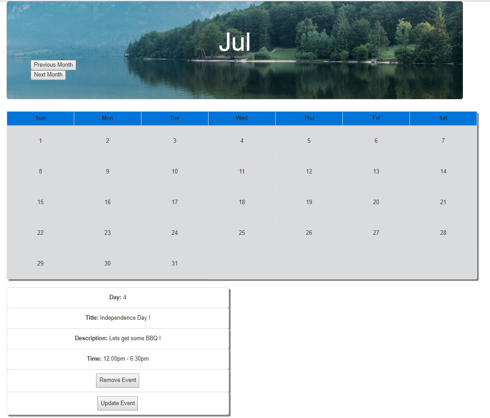

Calendar Web App

By: Evan Vasquez

==========How to get my project to work==========

1) Make sure your terminal is in the same directory as this readme.txt file.

2) Make sure you have "Node.JS" installed. Execute in the terminal "node app.js"

3) If you connected the database correctly, the terminal should say "Connected".

4) Go to your internet browser and type in the address bar: "127.0.0.1:8080" or "localhost:8080".

5) Have fun with the website!

==================================================

